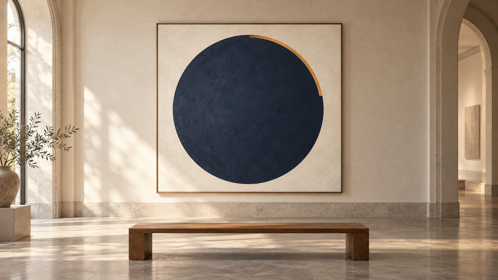
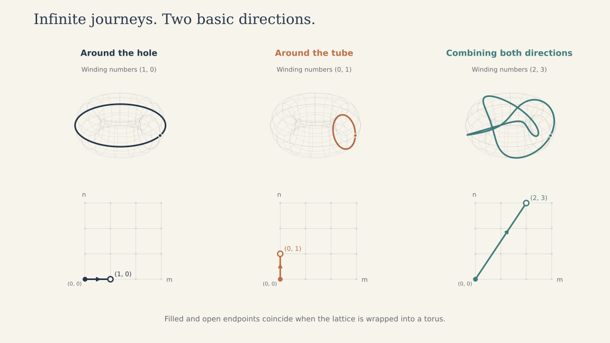

# Geometric Intuition and Open Questions

Imagine sitting on a museum bench in front of a painting of a circle. Trace its
edge in your mind. The curve is simple, but the number that measures a complete
turn also appears in formulas filled with factorials, square roots, and enormous
integers. What connects those two experiences of π?



*The circle as an object of contemplation: a visual starting point for the
questions below.*

That question motivates this project: **understand the arithmetic organization
behind the identities, and use it to ask better questions about convergence.**
This note preserves the geometric intuitions and research directions behind the
work. [REPORT.md](REPORT.md) contains the mathematical arguments and computational
claims; [README.md](README.md) introduces the formulas and how to reproduce them.

Throughout this note, **intuition** means a way to generate questions;
**established mathematics** means a result from the cited literature;
**repository result** means a claim supported within the report's stated scope;
and **open direction** means a question this repository has not settled. An
open direction here is not a claim that the wider literature has left it untouched.

## 1. The circle: how can a turn become an equation?

**Intuition.** Walking around the circle gives a natural unit of repetition.
Instead of measuring the path with a ruler, we can record a rotating point's
horizontal and vertical coordinates. Geometry becomes a changing pair of numbers.

**Established mathematics.** Euler's formula packages that motion into complex
arithmetic:

```math
e^{i\theta}=\cos\theta+i\sin\theta,
\qquad e^{i\pi}+1=0.
```

The second identity records a half-turn. It puts rotation, exponentiation, and
π in one equation. It gives a useful language for periodic behavior, but does
not by itself determine the constants in a Ramanujan series.

Another useful viewpoint is to obtain numbers by integration over geometric
regions or cycles. Mathematicians use the word *period* for precise versions of
this idea. The circle supplies basic examples; the theory extends much further.
Kontsevich and Zagier's [*Periods*](https://www.ihes.fr/~maxim/TEXTS/Periods.pdf)
is a starting point for that broader perspective. The technical notion has
algebraicity and convergence conditions; it is not a label for every integral.

**Question to carry forward.** Can two different descriptions of a geometric
quantity give an identity that is difficult to see from either description alone?

**Boundary.** A formula for 1/π does not make π algebraic. Infinite sums of
algebraic terms can have transcendental values. The exact constants in a formula
and the value of its infinite sum are different arithmetic questions.

## 2. The ellipse: what survives when we deform the circle?

**Intuition.** Stretch the painted circle into an ellipse. A familiar shape now
requires a less familiar measurement. This suggests studying how a quantity
changes with the shape, rather than looking only at one special value.

**Established mathematics.** Elliptic integrals arise in this setting. The ellipse's
perimeter involves the complete integral of the second kind, E. Its companion,
the complete integral of the first kind, is

```math
K(k)=\int_{0}^{\pi/2}\frac{d\theta}{\sqrt{1-k^{2}\sin^{2}\theta}},
\qquad K(0)=\frac{\pi}{2}.
```

For this discussion take real $`0\leq k<1`$. K is not itself the ellipse's
perimeter. Keeping that distinction matters when translating a picture into a
formula. The [definitions](https://dlmf.nist.gov/19.2) and
[Legendre relation](https://dlmf.nist.gov/19.7) show how these integrals and their
complementary versions fit together, with π appearing in an exact relation.

**Connection to this repository.** Elliptic and modular identities are part of
the established machinery behind the four series families we study. Expanding
functions as series supplies the coefficients; differentiating a power series
multiplies its nth coefficient by n. That helps explain the recurring factor
A + Bn. A complete derivation must also justify the special evaluation and all
normalizing constants; the picture alone does not supply them.

**Open direction.** For a proposed deformation, identify the integral, its
differential equation, and the relation that isolates π. This is a more useful
first target than asking whether every new silhouette has a unique π identity.

## 3. The torus: infinitely many journeys, but how much new information?

**Intuition.** Move from tracing one rim to tracing a torus. There are two basic
winding directions, and infinitely many ways to combine them and return to the
starting point. This was a particularly productive question: could those different
journeys expose the integers hidden inside the formulas?



*The filled and open lattice endpoints become the same point on the torus.
The lattice uses normalized coordinates; the torus drawings are topological
sketches, not an isometric embedding of a flat torus. Infinitely many winding
classes can be built from two basic directions.*

**Established mathematics.** In the complex-torus model, opposite edges of a
parallelogram are identified. Its two lattice periods, ω₁ and ω₂, give the periods
along winding classes:

```math
m\omega_{1}+n\omega_{2},\qquad m,n\in\mathbb{Z}.
```

Thus infinitely many winding classes need only two basic generators. A straight
trajectory closes when its direction is proportional to a lattice vector;
arbitrary directions need not close. Retracing or combining paths does not
automatically produce independent identities. The lattice description is developed
in the [DLMF treatment of elliptic-function periods](https://dlmf.nist.gov/23.2).

The ratio $`\tau=\omega_{2}/\omega_{1}`$ describes the complex shape after choosing
an oriented lattice basis. Changing that basis can describe the same torus in a
different way. Modular functions organize those changes of description.

At a complex multiplication (CM) point, τ satisfies an imaginary quadratic
equation. The torus then has extra endomorphisms—structure-preserving maps to
itself. CM theory controls the algebraicity of suitable modular-function values
at these points. These statements concern specific functions and maps, not a
rule that every measurement on a symmetric shape is algebraic. The relevant
field-control and modular-function sources are identified in
[the report](REPORT.md#3-every-coefficient-the-square-root-and-the-constant-term).

**Repository result.** Our level-2 analysis makes the symmetry question concrete.
Two modular descriptions are exchanged by an involution. The series parameter
x identifies the pair, reducing its degree. To obtain a saving for the whole
identity, the other coefficients must respect that identification too. The
square-root factor B and the ratio A/B are checked separately.

The [arithmetic explanation](REPORT.md#4-hidden-arithmetic-organization-why-the-winners-change)
shows why a change of conductor by 17 can give better convergence per degree
than another seemingly comparable stretch: the cost depends on how primes
behave in the number field. In these coordinates, stretching can make the series
parameter exponentially small, while arithmetic determines the price of that
stretch. This is an application of classical machinery; novelty of the exact
optimization table remains unestablished.

**Question to carry forward.** Which changes of description leave *every*
coefficient in the same smaller number field? That is the precise version of
asking which journeys reveal the same hidden organization.

## 4. Beyond the torus: choose a quantity as well as a shape

**Open directions.** More elaborate spaces widen the possible questions, but
the name of a space does not specify an identity. We need a quantity to calculate:
a period, a volume with a fixed normalization, an invariant, or a generating
function. Then we need a reason for its value to involve the desired power of π.

These are directions considered in the project's framing, not additional
certified constructions supplied by this repository:

| Geometry or limiting process | A question worth making precise | What would turn it into a useful result? |
| --- | --- | --- |
| Spheres and higher-dimensional spheres | What do volume or integral formulas reveal as dimension changes? | A series and a cost comparison that account for the normalization, rather than simply solving a known volume formula for π. |
| Fermat hypersurfaces in projective space | Which explicitly chosen periods admit useful series expansions and special evaluations? | A specified family, cycle, branch, evaluation theorem, and coefficient field. |
| Grassmannians and flag manifolds | Can a suitable generating function connect their counting geometry to a controlled π evaluation? | An explicit function and evaluation, with the cost of its coefficient sequence included. |
| Moduli spaces of curves | Can volume or intersection-number relations yield a useful series, beyond the known appearances of powers of π? | A justified series transformation and a fair comparison with existing identities. |
| Calabi–Yau families and their differential equations | When do higher-order period equations lead to identities for inverse powers of π? | A case whose proof status, power of π, and evaluation cost are stated explicitly. |
| Oeljeklaus–Toma manifolds | Can the number field used in their construction lead to a suitably normalized invariant and a π-series evaluation? | A concrete invariant and a replacement for any elliptic/CM steps that do not apply. |
| Calabi–Eckmann manifolds | Which quantities associated with these complex manifolds could support a comparable identity? | An explicit analytic construction, not an inference from complex structure alone. |
| Spaces of loops or functions | Can a well-defined integral or determinant over an infinite-dimensional setting yield a useful identity? | An explicit measure or operator, and justified convergence or regularization, with every normalization accounted for. |
| A limit as dimension tends to infinity | Can a carefully normalized sequence of finite-dimensional quantities produce a useful limiting identity? | Convergence and error estimates that justify the limit and any interchange of sums, integrals, or limits. |

**Established footholds.** This landscape already has substantial literature.
Mirzakhani's work connects geometry and moduli-space volumes through
[effective recursion formulas](https://www.math.stonybrook.edu/~mlyubich/Archive/Geometry/Teichmuller%20Space/Mirz3.pdf).
Almkvist and Guillera's
[*Ramanujan–Sato-like series*](https://arxiv.org/html/1201.5233v3) connects
Calabi–Yau differential equations with series for 1/π² and includes conjectural
ingredients in its search for examples. Its results must be read with those
qualifications. Moving to higher dimension is not, by itself, entering an
unexplored area or extending a theorem about 1/π to 1/π².

Oeljeklaus and Toma explicitly construct
[non-Kähler compact complex manifolds from number fields](https://www.numdam.org/articles/10.5802/aif.2093/).
Calabi and Eckmann's
[original construction](https://www.jstor.org/stable/1969750) provides another
class of compact complex manifolds outside the algebraic setting. These make
interesting tests of which geometric ingredients the classical construction
really needs. This repository currently contains no certified π-series
construction from either family.

**Working rule.** A worthwhile outcome need not be a unique new identity. It can
be a derivation of a known identity, a transformation showing two formulas are
equivalent, a better coefficient representation, or a precise obstruction under
stated assumptions. Each teaches us something about the organization we seek.

## 5. What should an elegant identity optimize?

Return to the circle on the wall. Suppose one description takes hundreds of
small steps and another takes only a handful. The second is appealing—until we
learn how much work is required to specify where each large step should land.

**Repository result.** That distinction is measurable. At a certified absolute
error target below 10⁻¹⁰⁰⁰⁰, the degree-32 identity uses 28 terms in our benchmark;
Chudnovsky's identity uses 706. Computing every polynomial root at full precision
makes the degree-32 setup expensive: about 3.20 seconds total in a comparison
run. Isolating the needed root once at low precision and refining its certified
interval reduces that to about 0.103 seconds, versus 0.417 seconds for our simple
Chudnovsky implementation. At 1,000 digits, Chudnovsky remains faster. None of
these implementations uses optimized binary splitting; the [report](REPORT.md#practical-evaluation-cost)
gives the shared summation method, protocol, and limitations.

**Interpretation.** “Maximal convergence” becomes a useful research target only
after specifying a cost and a class of allowed formulas. Otherwise we can hide
work in larger constants, more elaborate coefficient sequences, or even the
meaning of a single term. This project fixes four kernels, charges the joint
coefficient degree, and forbids regrouping terms. That makes one comparison
precise; the benchmark shows why it cannot be the only comparison.

A broader account of elegance can ask several questions together:

- How many digits does an extra term contribute?
- What number field is required by all coefficients, including outside factors?
- How large are their exact descriptions, and how difficult is root isolation?
- What does setup cost at the required precision?
- What mathematical relation makes the identity understandable and checkable?

**Open direction.** The most immediate experiment is to simplify the degree-32
coefficient construction and measure the effect. Another is to finish the
intermediate-degree staircase. A wider geometric search becomes comparable only
when it also charges for a changed kernel and its evaluation. These are distinct
research questions; improving one measure need not improve the others.

## 6. From a picture to a research question

When a calculation stalls, the picture can still help. Ask what was being
preserved: a complete turn, a period, a winding class, or a quantity unchanged
by a symmetry. Then write down the exact object that represents it.

For an exploration to join the technical report, it should supply:

1. **An object and quantity:** the space, parameter, integral or invariant, and
   normalization, all specified independently of the π value being sought.
2. **A mathematical bridge:** an identity, differential equation, transformation,
   or evaluation theorem, with literature and proof status identified.
3. **Arithmetic control:** all coefficient fields, branches, and prefactors.
4. **A fair measurement:** the series kernel, convergence rate, representation,
   setup cost, and a justified error bound.
5. **A clear outcome:** a theorem in a stated scope, a reproducible observation,
   an explicitly labelled conjecture, or a limited negative result.

The museum question remains useful: how can a simple circle be related to such
complicated exact constants? The work here gives a partial answer through
periods, modular relations, and arithmetic symmetries. The open questions ask
how far those mechanisms extend, and whether understanding them can make the
formulas simpler to explain, certify, or compute.
