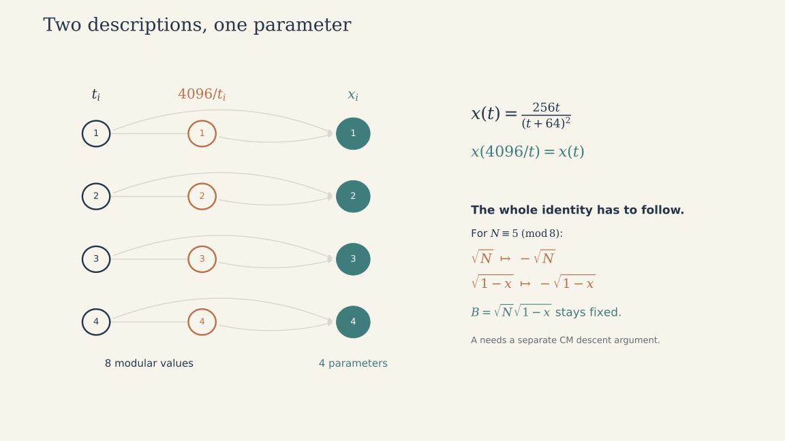

# Speed versus full coefficient degree in four CM families

Research record, 8 October 2026. Computational claims here are reproducible with
the accompanying Python/FLINT package. Standard theorems used as inputs are
identified below. This is a research snapshot, not an independently refereed paper.

## Main finding

The central question is how much convergence a fixed algebraic degree can buy.
Within four specified families, the degree-32 optimum gives
366.5212453310619 decimal digits per term. Its coefficients have an explicit
algebraic construction, and an exhaustive comparison excludes faster eligible
parameters. Section 6 presents the results and completeness ledger.

In plain language, the formulas make a trade: more complicated constants can
make each extra term much more informative. We measure that complication by the
algebraic degree of all constants together. This measures one kind of arithmetic
complexity; it does not measure the time needed to compute the constants.

Readers new to the subject can start with the classic formula and explanation
in [README.md](README.md). Sections 1–5 give the mathematical argument; section 6
collects the results and practical timings.

The construction methods are classical. The possible contribution is a carefully
defined, reproducible optimization table, with every coefficient included in the
cost, together with an explanation of its discontinuities. Literature novelty of
that exact table has not been established.

## 1. Precise question and limits

Fix the four normalized kernels

```math
 c_{s,n}=\frac{(s)_n(1/2)_n(1-s)_n}{(n!)^3},\qquad
 s\in\{1/6,1/4,1/3,1/2\},
```

and canonical CM identities

```math
 \frac1\pi=\sum_{n\ge0}(A+Bn)c_{s,n}x^n,\quad 0<|x|<1.
```

The levels are respectively 1,2,3,4. CM means that the modular parameter is an
imaginary quadratic point. The optimization is over these canonical modular
constructions, including conjugate parameters and nonmaximal quadratic orders.
It is not over every conceivable algebraic hypergeometric identity.

The budget is **at most** $`d=[\mathbb Q(A,B,x):\mathbb Q]`$, not the largest of
the three individual degrees. For example, two quadratic numbers can generate a
quartic field. Any prefactor outside a printed sum is absorbed into A and B.
Grouping many old terms into one new term is disallowed. The asymptotic objective
is $`r=-\log_{10}|x|`$; the normalized kernels have convergence radius one.

This cost is intrinsic to the coefficients, but it is not the complete cost of
computing with them. Polynomial heights, representations, root isolation, setup,
and arithmetic still matter. A formula can have better r and worse elapsed time.

## 2. Completeness: where the infinite problem becomes finite

Write the CM discriminant as $`\Delta<0`$, and its class number as $`h(\Delta)`$.
At levels 1 and 4 the j-invariant is a rational function of x. At levels 2 and 3
it satisfies a quadratic over $`\mathbb Q(x)`$. Consequently,

```math
 h(\Delta)\le d\quad(1,4),\qquad h(\Delta)\le2d\quad(2,3).
```

These are necessary conditions even if A needs an additional extension. That
makes them safe for excluding competitors without assuming an A-field theorem
for every discarded row.

Watkins' classification gives a complete list of fundamental discriminants for
class numbers through 100 [1]. We independently enumerate reduced forms and
match each published count and largest discriminant for h through 64. This
produces 17,711 fundamental fields. Nonmaximal orders are included using

```math
 h(f^2\Delta_0)=\frac{h(\Delta_0)}{u_f}
 f\prod_{p\mid f}\left(1-\frac{(\Delta_0/p)}p\right).
```

For f>1, the unit index is 3 for $`\Delta_0=-3`$, 2 for -4, and 1 otherwise;
f=1 is handled separately. The completeness checker enumerates conductors
using a finite bound rather than a recursive prime-conductor search. Since the product expression is at least $`\varphi(f)`$, and
$`\varphi(f)\ge\sqrt{f/2}`$, the explicit bound

```math
 f\le2\left(\frac{u_fH}{h(\Delta_0)}\right)^2
```

allows an independent finite conductor loop. This yields 7,225 orders for H=32
and 27,963 for H=64. The H=32 catalogue agrees exactly with the fixed search
records in `data/orders32.json`.

For each order the certified Hilbert class polynomial H is substituted into the
exact modular relation. Integer factorization gives candidate minimal polynomials
for x. The B-field is checked by a second exact polynomial factorization. Root
ordering uses integer Rouche inequalities or certified complex balls; floating
point estimates are not accepted as exclusion proofs.

### Reducing the factorization problem

Suppose h>d at level 2 or 3. Reduce H(j) using the quadratic relation for j:

```math
 H(j)=\frac{u(x)j+v(x)}{a(x)^h}.
```

For any eligible x of degree at most d, j cannot belong to $`\mathbb Q(x)`$,
because j has degree h. The quadratic relation is therefore irreducible over
that field. Thus H(j)=0 forces **both** u(x)=0 and v(x)=0. Every eligible minimal
polynomial divides gcd(u,v). This avoids factoring the much larger full norm
resultant in the hardest part of the degree-32 search. It is a consequence of
field degrees, not a conjectured pattern in factorization data.

### Audit outcome and the boundary above degree 32

The degree-16 reconstruction produces 3,214 eligible parameter polynomials at
levels 2–4 and checks every factor product, including the reasons for excluding
other factors. It also checks the B-degree for all 1,931 nonsingular level-1
orders in the catalogue. The ranking checker uses 3,175 exact Rouche exclusions
and 39 certified root sets.

The degree-32 run covers all 27,963 required orders and all four kernels. Its
machine-readable exclusion ledger is the authoritative run record. A PASS means
no eligible competitor has a smaller |x| than the N=73117 example. Section 6
records the successful comparison and its coverage.

For budgets 64,80,96,128, the same general reduction needs order class numbers
through 128,160,192,256. The Watkins table used here does not cover those complete
searches. Holmin et al. extend a different, **odd-class-number** catalogue under
GRH [7]; it does not silently supply the even-class-number cases we need. Higher
rows below are therefore feasible lower bounds, not proved optima. This is a
limitation of our present completeness inputs, not a proof that extension is
impossible.

## 3. Every coefficient: the square root and the constant term

For level 2 at $`\tau=(-1+i\sqrt N)/2`$, define

```math
 t=\left(\frac{\eta(\tau)}{\eta(2\tau)}\right)^{24},\quad
 x=\frac{256t}{(t+64)^2},\quad
 B=\sqrt{N(1-x)}.
```

If p is an irreducible degree-m polynomial for x, then
$`N^m p(1-T^2/N)`$, made primitive, is a polynomial for B. Because
$`x=1-B^2/N`$, the field generated by x and B is just $`\mathbb Q(B)`$.
Its degree is either m or 2m. Factorization decides which.

For the degree-32 winner the latter polynomial splits into two irreducible
degree-32 factors. There is also a direct square certificate: split one factor
as $`g(T)=E(T^2)+TO(T^2)`$. Then, on the appropriate branch,

```math
 B=-\frac{E(N(1-x))}{O(N(1-x))}.
```

The stored numerator and denominator satisfy
$`\mathrm{num}^2-N(1-X)\mathrm{den}^2\equiv0\pmod{p(X)}`$, with a nonzero
denominator modulo p. This proves membership in $`\mathbb Q(x)`$, rather than
merely observing a numerical square root.

### Why A does not introduce a hidden extension

Here is the descent argument used for the winning level-2 identities. Put
$`D_q=(2\pi i)^{-1}d/d\tau`$, $`y=\mathrm{Im}\tau`$, and
$`F(x)=\sum c_{1/4,n}x^n`$. The standard modular identities give

```math
 D_q\log x=F\sqrt{1-x},\quad
 G^{\ast}=\frac{D_q\log F-1/(2\pi y)}{D_q\log x},\quad A/B=-G^{\ast}.
```

Let $`\psi=E_2^{\ast}E_4/E_6`$. The Masser field-inclusion and Galois-equivariance
results, in the formulation of Spence's Propositions 5.1–5.2 [2], place its CM
value in $`\mathbb Q(j)`$ and make its conjugates compatible with those of j.
In level 2, direct logarithmic differentiation gives

```math
 G^{\ast}=\frac{\psi-1}{6}C(t)-L(t),\qquad
 C(t)=\frac{(t-512)(t+64)}{(t+256)(t-64)},\quad
 L(t)=\frac{96t}{(t+256)(t-64)}.
```

Thus G* lies in $`\mathbb Q(t)`$, an extension of $`\mathbb Q(x)`$ of degree
at most two. Its possible nontrivial automorphism is $`t\mapsto4096/t`$, the
Fricke involution. The completed logarithmic derivative in G* and its denominator
both transform with weight two, so their ratio is Fricke invariant. Galois
equivariance therefore fixes G*, proving

```math
 A/B\in\mathbb Q(x),\qquad
 \mathbb Q(A,B,x)=\mathbb Q(x,B).
```

The winners avoid elliptic points and all displayed denominators are nonzero.
For exclusion of competitors, only the necessary x/B degree is used, so special
points do not create an A-descent loophole in the upper bound.

This is an application of established CM theory. It is not a claim that we
discovered the algebraicity theorem. The expanded rational expression A(x) is
not stored; the separate algebraic recipe below computes A through auxiliary
j-values. Auxiliary fields can be larger than the intrinsic final coefficient
field, and their computational cost should be reported separately.

## 4. Hidden arithmetic organization: why the winners change

For odd $`N>1`$, $`N\equiv1\pmod4`$, the CM order has discriminant -4N.
The prime 2 ramifies and its ideal class has order two. The horizontal 2-isogeny
pairs conjugates. The t-coordinate remembers the two ends; x identifies them:

```math
 t\longmapsto4096/t,\qquad x\longmapsto x.
```

The two endpoints are distinct: in $`\mathbb Z[\sqrt{-N}]`$, the equation
$`a^2+Nb^2=2`$ has no solution for these N>1. Standard CM reciprocity gives
t in the ring class field and j as a rational function of t; in the chosen real
embedding this yields degree h(-4N) for t. Since x is the quotient by this
order-two action, its degree is h(-4N)/2. The ramified-prime pairing is established
class-invariant machinery [3], not a new symmetry.

The subtle point is B. Write N=Mf² with M squarefree and f odd. The genus field
contains $`\sqrt M`$, hence $`\sqrt N`$. The norm-two ideal acts on it by the
quadratic character $`(M/2)=(N/2)`$. Meanwhile

```math
 \sqrt{1-x}=\frac{t-64}{t+64}
```

changes sign under the same involution. Therefore the product B has two sign
changes when N≡5 mod8, and only one when N≡1 mod8. Combining this with A-descent:

```math
 [\mathbb Q(A,B,x):\mathbb Q]=
 \begin{cases}
 h(-4N)/2,&N\equiv5\pmod8,\\
 h(-4N),&N\equiv1\pmod8.
 \end{cases}
```

This is our synthesis of the standard reciprocity, genus-character, and descent
arguments. Twenty-eight exact examples, including all distinct degree-16
level-2 winners and opposite-sign controls, were checked. Finite checks support
the implementation; the argument supplies the general explanation. No novelty
claim is made for this consequence of classical theory.



*Schematic eight-to-four pairing, not a numerical plot of the degree-32 roots.
Identifying the paired t-values halves the parameter degree. The full identity
benefits only when B and A also lie in the smaller field, as established above
and in section 3.*

### Conductors give the second part of the story

For squarefree M≡5 mod8, let h0=h(-4M). For odd conductor f,

```math
 d=\frac{h_0}{2}f\prod_{p\mid f}\left(1-\frac{(-4M/p)}p\right),\qquad
 r\sim\frac{\pi f\sqrt M}{\log10}-\log_{10}256.
```

Changing f stretches the torus parameter linearly. Its algebraic cost depends
on whether each prime splits, ramifies, or stays inert. At a new prime p the
class-number multiplier is p−1, p, or p+1. That makes certain changes of conductor
better value than a uniform doubling strategy.

The degree-2 seed has M=253 and h0=4. Conductor 7 has character -1, so its
multiplier is 8, giving degree 16 and N=12397. Conductor 17 has character +1,
so its multiplier is 16, giving degree 32 and N=73117. The latter increases the
geometric stretch by 17/7 while only doubling the final coefficient degree.
The arithmetic of the conductor therefore explains why the degree cost does
not simply track the geometric stretch.

The frontier also has plateaus: degrees 9 and 10 share a winner, as do 13 and 14.
At a budget of 80 the listed candidate uses only degree 76; at 128 it uses 126.
A powers-of-two-only table would conceal that structure.

## 5. The degree-32 identity is concrete

It has the form

```math
 \frac1\pi=\sum_{n\ge0}(A+Bn)
 \frac{(1/4)_n(1/2)_n(3/4)_n}{(n!)^3}x^n,
 \qquad B=\sqrt{73117(1-x)}.
```

The polynomial p for x is stored in `results/candidate32.json`, with coefficients
in ascending order. Its degree is 32; its largest coefficient has 432 decimal
digits (1434 bits). Choose its unique real root in
$`(-4\cdot10^{-367},-2\cdot10^{-367})`$. The rate is
366.5212453310619038906676419874… digits per term.

The following exact algebraic recipe supplies A without defining it from π.
Start with the Borweins' published N=253 coefficients [4]:

```math
 Y=2216752650+668376072\sqrt{11},\quad x_0=-Y^{-2},
```
```math
 A_0=\frac{-37515813+11937508\sqrt{11}}{6523272},\qquad
 B_0=-\frac{9686105}{543606}+\frac{8291270\sqrt{11}}{815409}.
```

For i=0,1 set N0=253, N1=73117, x1=x and B1=B, and define

```math
 s_i=B_i/\sqrt{N_i},\quad t_i=64(1+s_i)^2/x_i,\quad
 J=(t_0+256)^3/t_0^2,\quad K=(t_1+256)^3/t_1^2,
```
```math
 \psi_0=1+6[-A_0/B_0+L(t_0)]/C(t_0).
```

Let P(J,K)=Φ17(J,K), the classical modular polynomial from Sutherland's data
[5]. Partial derivatives below are those of this explicit integer polynomial.
Define the rational functions

```math
 R=-\frac{J\,P_J}{17K\,P_K},\quad
 U_J=\frac{P_{JJ}}{P_J}+\frac1J-\frac{P_{JK}}{P_K},\quad
 U_K=\frac{P_{JK}}{P_J}-\frac{P_{KK}}{P_K}-\frac1K,
```

```math
 W=-JU_J-17RKU_K,
```
```math
 \psi_1=\frac6{17R}
 \left(W+\frac{\psi_0}{6}-\frac{J}{2(J-1728)}+\frac13\right)
 +\frac{3K}{K-1728}-2,
```
```math
 \boxed{A=B\left(\frac{1-\psi_1}{6}C(t_1)+L(t_1)\right).}
```

To derive this, put V=E6/E4. Differentiating P(j(τ),j(17τ))=0 gives
V(17τ)/V(τ)=R. The Ramanujan differential identities imply

```math
 D_q\log V-\frac1{2\pi y}
 =V\left(\frac\psi6-\frac{j}{2(j-1728)}+\frac13\right).
```

Subtract the two logarithmic derivatives. Their nonholomorphic correction terms
cancel, giving the displayed expression for ψ1. This transfers the known base
identity through the 17-isogeny. The script implements the same equations.

### Error and polynomial certificates

The Φ17 data are independently checked using 631 exact integer q-coefficients.
Multiplying its proposed modular relation by Δ(τ)^18 Δ(17τ)^18 gives weight 432
on Γ0(17), of index 18. Its Sturm bound is 648 [6]. After accounting for the
leading q-powers, the 631 checks prove the relation, rather than just testing it
at one CM point.

The final coefficients are evaluated from algebraic roots, integer arithmetic,
and square roots. Only the final independent comparison calls an implementation
of π. A geometric majorant for the remaining summands supplies an error interval.

| Terms retained | Certified absolute error below |
|---:|---:|
| 1 | 10^-364 |
| 2 | 10^-730 |
| 3 | 10^-1097 |
| 4 | 10^-1463 |

These are error guarantees, not claims about the last displayed rounded digit.

## 6. Results and what each row establishes

| Budget | Actual full degree | N at level 2 | Digits per term | Status |
|---:|---:|---:|---:|---|
| 2 | 2 | 253 | 19.293494464 | Certified optimum in the four fixed CM families |
| 4 | 4 | 445 | 26.373310749 | Certified optimum in that scope |
| 8 | 8 | 2893 | 70.976946288 | Certified optimum in that scope |
| 16 | 16 | 12397 | 149.503901039 | Certified optimum in that scope |
| 32 | 32 | 73117 | 366.521245331 | Certified optimum in the four fixed CM families |
| 64 | 64 | 243133 | 670.345527340 | Feasible lower bound; not an optimum certificate |
| 80 | 76 | 346357 | 800.555933915 | Feasible lower bound; not an optimum certificate |
| 96 | 96 | 558877 | 1017.573278207 | Feasible lower bound; not an optimum certificate |
| 128 | 126 | 953197 | 1329.657066872 | Feasible lower bound; not an optimum certificate |

### Completeness ledger

The degree-32 comparison in `results/extension32.json` reports **PASS**, with
no faster eligible parameter among all 27,963 required quadratic orders across
the four families. The ledger records 28,434 empty covers, 41,476 exact Rouche
exclusions, and 466 factor sets. These count different operations, not disjoint
sets of orders. Together with the coefficient-field argument and the verified
construction, the comparison establishes the scoped degree-32 optimum.

The saved exhaustive run takes 1,067.84 seconds on its original machine. This
is the cost of the optimality search, not the cost of evaluating the resulting
identity. Evaluation timings below measure a different task.

For the last four rows, irreducible x-polynomials and exact B-field certificates
are stored in `results/higher_candidates.json`. A-field membership follows from
the same descent argument, but explicit A recipes and truncation certificates
for these rows are not supplied. The selection uses only fundamental seeds of
class number at most 64 and odd conductors; other seeds or other families may
improve them.

The largest coefficient of the chosen x-polynomial grows from 20 decimal digits
at degree 2 to 30 at 4, 76 at 8, 184 at 16, and 432 at 32. This is a concrete
reason to supplement the degree frontier with a representation-size and timing
frontier. Those polynomial heights depend on the chosen coordinate.

### Practical evaluation cost

`python code/benchmark.py --digits 1000 10000 --repeats 5` compares the classic
Ramanujan identity [8, §4.2], the Chudnovsky identity [11], and the
construction in section 5. Each run stops only when its approximation has a
certified **absolute error below 10 to the negative target power**, including
coefficient rounding and the infinite tail. This is not a comparison of rounded
output strings.

The original Chudnovsky source is their 1988 chapter [11]. Campbell–Cooper–Ye
also restate this exact formula in §4.3, equation (4.2) of [8]; that is a
convenient modern reference rather than its original attribution.

| Target error exponent | Identity | Terms | Setup (ms) | Sum + bound (ms) | Total (ms) |
| ---: | --- | ---: | ---: | ---: | ---: |
| 1,000 | Ramanujan (1103) | 126 | 0.010 | 2.606 | 2.616 |
| 1,000 | Chudnovsky | 71 | 0.012 | 1.550 | 1.560 |
| 1,000 | CM degree 32 | 3 | 11.359 | 0.067 | 11.427 |
| 10,000 | Ramanujan (1103) | 1,253 | 0.071 | 678.154 | 678.240 |
| 10,000 | Chudnovsky | 706 | 0.139 | 417.043 | 417.187 |
| 10,000 | CM degree 32 | 28 | 86.929 | 14.978 | 102.710 |

**Protocol.** Entries are separate medians of five measured trials, so component
medians need not sum exactly to the total median. There is one unmeasured warm-up
per method and target. Method order rotates across repeats. The run uses Python
3.12.14, python-flint 0.9.0, one FLINT thread, and 128 guard decimal digits on
Linux x86-64 with an AMD EPYC 9V74 CPU, in a shared container. No claim of an
otherwise idle machine is made. The JSON record includes all timing samples,
input hashes, environment details, and the certified error bound for every trial.

**What is charged.** Every trial starts with coefficient reconstruction, including
root isolation and modular-polynomial evaluation for degree 32. Its existing
constructor also formats diagnostic values; that cost is included. The second
stage uses the same direct term-by-term recurrence and geometric tail bound for
all three identities. It includes interval arithmetic and final inversion.
No coefficient values are reused between measured trials. Interpreter/import
startup, exhaustive optimality search, theorem replay, independent reference-π
checks, and writing the output JSON are excluded; filesystem and library caches
are warm. Neither construction nor the stopping rule uses the reference π.

**Root isolation and refinement.** The archived initial benchmark
(`results/benchmark.json`) has setup times of 65.810 ms and 3260.401 ms:
about 49.5 times the work for ten times the target precision. Two timings alone
do not establish an asymptotic complexity law. Profiling nevertheless identifies
a concrete cause: the constructor computes all 32 roots at full precision,
although it only needs the one real root in the specified interval.

The default constructor isolates that root at 80 decimal digits, then doubles
working precision and refines its enclosure. If I contains the root r and m is
its midpoint, the mean value theorem puts r in `m - p(m)/p'(I)`, provided the
derivative interval excludes zero. Intersecting this interval with I retains
the root. Arb bounds every evaluation and rounding error; the code checks the
achieved accuracy and refuses to proceed if refinement fails. No value of π is
used. Tests compare this enclosure with an independent all-roots isolation at
higher precision.

Here is a comparison rerun with the same source, environment, target errors,
five-trial protocol, and unchanged modular-polynomial evaluation. The
`--root-method all-roots` option retains the baseline for reproduction. No root
or coefficient is cached between trials, even in the Newton version.

| Target error exponent | All-roots setup (ms) | Refined-root setup (ms) | All-roots total (ms) | Refined-root total (ms) |
| ---: | ---: | ---: | ---: | ---: |
| 1,000 | 56.434 | 11.359 | 56.507 | 11.427 |
| 10,000 | 3185.657 | 86.929 | 3201.426 | 102.710 |

**Interpretation.** At 10,000 digits, root refinement reduces setup by about
36.6 times and total time by about 31.2 times. The degree-32 identity still uses
28 terms, versus 706 for Chudnovsky. Its total is now about 0.103 seconds,
compared with 0.417 seconds for this direct Chudnovsky implementation. At 1,000
digits the degree-32 setup still outweighs its summation advantage: about
11.4 ms total versus 1.56 ms for Chudnovsky. The crossover reinforces the need
to measure both setup and summation at the requested accuracy.

These measurements do not establish the fastest π algorithm. None of the three
implementations uses binary splitting. An optimized Chudnovsky or Arb π
implementation is the necessary next baseline, with repeated measurements on
controlled hardware. Polynomial heights and modular-polynomial evaluation
remain costs to measure when comparing alternative coefficient generators.

Raw evidence: [`results/benchmark_newton.json`](results/benchmark_newton.json)
for the default implementation and
[`results/benchmark_all_roots.json`](results/benchmark_all_roots.json) for the
comparison run. Both include source hashes, all samples, and certified errors.
The initial measurement remains in
[`results/benchmark.json`](results/benchmark.json). To repeat the comparison:

```sh
python code/benchmark.py --digits 1000 10000 --repeats 5 --root-method newton --output results/latest/benchmark-newton.json
python code/benchmark.py --digits 1000 10000 --repeats 5 --root-method all-roots --output results/latest/benchmark-all-roots.json
```

## 7. Literature audit and assessment

There is extensive prior art. Borwein and Borwein already give algebraic series
and methods for producing more of them [4]. Enge and Sutherland explicitly
describe degree halving for ramified-prime Fricke invariants [3]. Masser/Spence
provide the CM field-control input [2]. These are building blocks we use.

Campbell, Cooper and Ye's 2026 paper classifies rational and quadratic series
across genus-zero Fricke groups [8]. Its convention concerns the coefficients
inside the sum and allows an algebraic multiplier of 1/π; that convention must
be translated before comparison with our full normalized joint degree. Their
range of levels is much broader than our four kernels.

Hemmecke, Paule and Radu's 2026 work provides algorithmic Sato constructions with
rigorous algebraic evaluations and software [9]. Thus an automated generator or
one more large constant is not, by itself, a strong novelty claim. Huber, Schultz
and Ye also systematically classify rational and quadratic cases [10].

The sweep did not establish a published table matching this exact full-degree,
four-kernel optimization problem. That is **not evidence sufficient to claim
priority**. Before a paper, the remaining novelty check should compare the
actual tables and transformations in those works and related computational
supplements, then seek specialist review of the optimization scope and proof.

The package is already useful as an auditable repo. A possible computational
paper should lead with the finite reduction, the exact coefficient-field test,
the certified frontier and its arithmetic explanation. The 366-digit identity
would illustrate that result. It should not be advertised as a new mechanism
for constructing π series or as the fastest practical π algorithm.

## 8. Recommended next work

1. Benchmark the refined-root constructor against optimized baselines at fixed
   certified accuracy. Then reduce the degree-32 A recipe directly into Q(x) and
   compare alternative generators, charging representation size, root refinement,
   modular-polynomial evaluation, and summation time.
2. Obtain an independent implementation/review of the degree-32 completeness
   proof, especially the modular maps and A-field descent. The reconstruction
   and checking programs both use FLINT; this is not cross-CAS verification.
3. Fill all budgets 17–31 to display the full staircase, then exploit Watkins'
   h≤100 range to reach budget 50 where appropriate. Do not relabel the higher
   feasible rows as optimal without the missing global bounds.
4. Extend the symmetry test to other levels and kernels with an explicitly
   charged kernel cost. This tests whether level 2's advantage survives a wider
   contest, rather than changing the rules invisibly.

## Sources

1. Mark Watkins, *Class numbers of imaginary quadratic fields* (2004), concluding
   table, PDF p.23: https://magma.maths.usyd.edu.au/~watkins/papers/smallcn.pdf
2. Haden Spence, *Ax–Lindemann and André–Oort for a Nonholomorphic Modular
   Function*, Propositions 5.1–5.2: https://arxiv.org/pdf/1607.03769
3. Andreas Enge and Andrew V. Sutherland, *Class invariants by the CRT method*,
   §§3–4, especially the ramified-prime pairing: https://arxiv.org/pdf/1001.3394
4. J. M. Borwein and P. B. Borwein, *More Ramanujan-type series for 1/pi* (1988),
   Type-2 tables: https://www.cecm.sfu.ca/~pborwein/PAPERS/CP4.pdf
5. Andrew V. Sutherland, *Modular polynomials*:
   https://math.mit.edu/~drew/ClassicalModPolys.html ; exact data:
   https://math.mit.edu/~drew/modpolys/jfiles/phi_j_17.txt
6. William Stein, *Modular Forms: A Computational Approach*, Theorem 9.18:
   https://wstein.org/books/modform/modform/newforms.html
7. Holmin, Jones, Kurlberg, McLeman and Petersen, *Missing class groups and class
   number statistics for imaginary quadratic fields*: https://arxiv.org/abs/1510.04387
8. Campbell, Cooper and Ye, *Quadratic irrational analogues of Ramanujan's series
   for 1/pi* (2026): https://arxiv.org/html/2602.09352v1
9. Hemmecke, Paule and Radu, *Computer-assisted construction of Ramanujan–Sato
   series for 1 over pi* (2026): https://doi.org/10.1007/s11139-026-01352-2
10. Huber, Schultz and Ye, *Ramanujan–Sato series for 1/pi*, Acta Arithmetica 207
    (2023), 121–160: https://doi.org/10.4064/aa220621-19-12 ; author repository:
    https://scholarworks.utrgv.edu/mss_fac/366/
11. D. V. Chudnovsky and G. V. Chudnovsky, *Approximations and complex
    multiplication according to Ramanujan*, in *Ramanujan Revisited*
    (Urbana-Champaign, Illinois, 1987), Academic Press, Boston, 1988,
    pp. 375–472. See also the explicit restatement in [8, §4.3, equation (4.2)].
